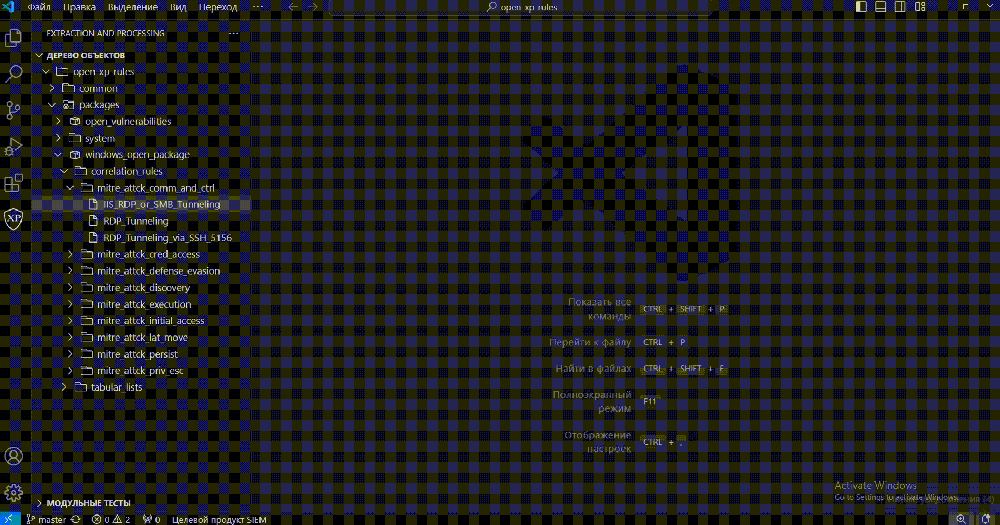
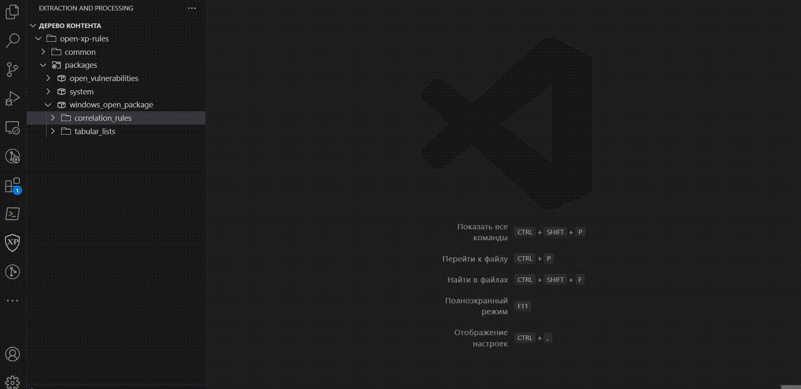
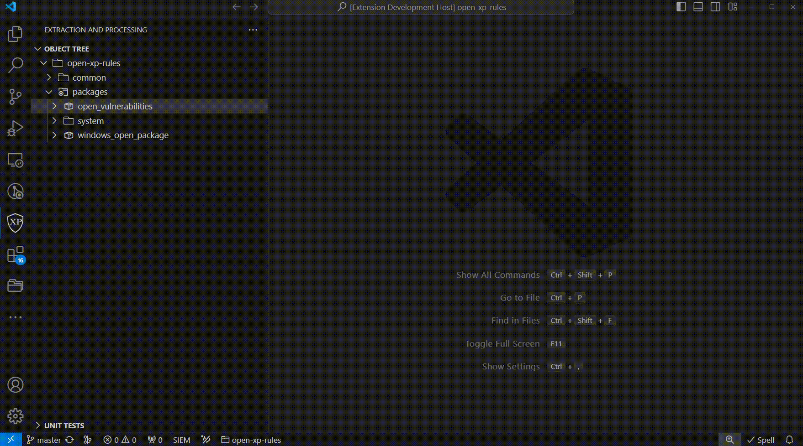

# Getting started

You can install the extension very quickly from the VSCode marketplace:

To simplify the creation of rules, the most popular templates are used:

The extension provides auto-completion of taxonomy fields, keywords, functions with their descriptions. Snippets (template pieces of code) are also available to speed up and simplify the addition of XP language constructs:

Testing a rule is the key to its stable and accurate operation without false positives. This is how you need to work with integration tests for correlations and enrichments:

This is how you need to create integration tests:

Check the localization of rules, as well as test entire directories with rules:

If you collect events from Windows logs, you can convert them to the desired format as follows:

Validation of displayed rules (testing of code and localizations, correctness of the rule structure):

If you want to correlate EVTX files using selected content:

You can create a table list in a very simple way:

To load the resulting content into the product, you must export to a KB file:

