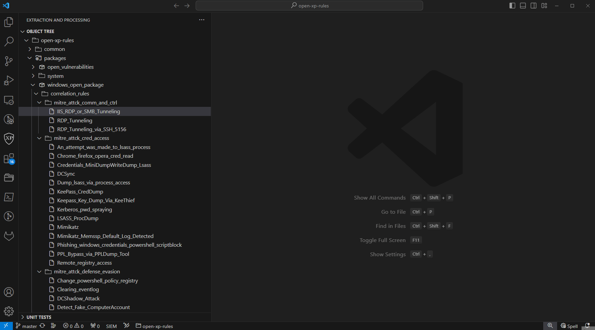

# Getting started

Установить расширение можно очень быстро из маркетплейса VSCode:

Для упрощения создания правил используются наиболее популярные шаблоны:

В расширении доступно автодополнение полей таксономии, ключевых слов, функций с их описанием. Также доступны сниппеты (шаблонные кусочки кода), ускоряющие и упрощающие добавление конструкций языка XP:

Тестирование правила - это залог его стабильной и точной работы без ложных срабатываний. Вот так необходимо работать с интеграционными тестами для корреляций и обогащений:

Вот таким образом нужно создавать интеграционных тестов:

Проверять локализации правил, а также тестировать целые директории с правилами:

Если вы собираете события из журналов Windows, то их можно следующим образом преобразовать в нужный формат

Валидация отображаемых правил (тестирование кода и локализаций, корректность структуры правила):

Если вы хотите коррелировать EVTX-файлы с использованием выбранного контента:

Создавать табличный список можно очень простым образом:

Для загрузки полученного контента в продукт необходимо выполнить экспорт в KB-файл:

